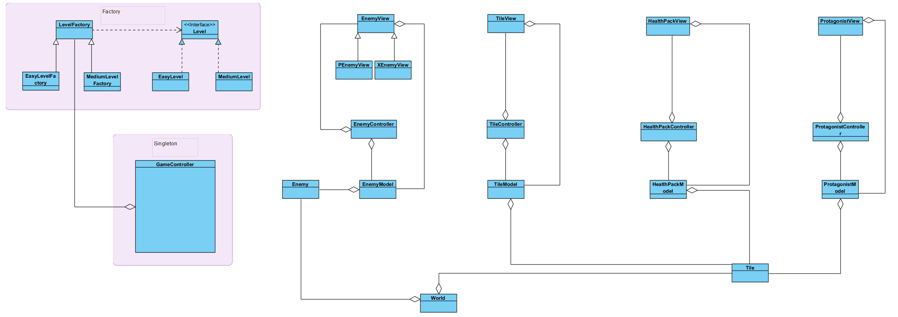

# Final Project Repo

## Description:

This project develops a grid-based game with manual and auto-play modes, featuring a 2D protagonist navigating enemies, health packs, and two visualization options (graphical and text-based). The architecture follows the MV(C) design pattern, leveraging the "world_v6" header file for essential functionalities. 

## UML:
- The UML class diagram below provides an overview of the class structure, relationships, and method signatures. 

    

