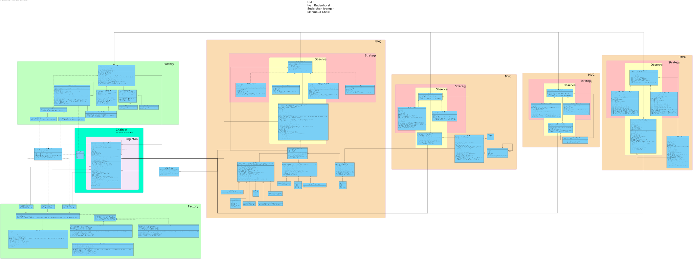

<br />
<div align="center">

<h1 align="center">Prison Escape</h1>

  <h4 align = "justify">
    A 2D game developed in C++ using Qt where a prisoner defeats different types of prison guards through various terrains to escape.
  </h4>
</div>


<!-- TABLE OF CONTENTS -->
<details>
  <summary>Table of Contents</summary>
  <ol>
    <li><a href="#about-the-project">About The Project</a></li>
    <li>
      <a href="#getting-started">Getting Started</a>
      <ul>
        <li><a href="#prerequisites">Prerequisites</a></li>
        <li><a href="#clone-repo">Clone Repo</a></li>
      </ul>
    </li>
    <li><a href="#structure-and-usage">Structure and Usage</a>
    <ul>
        <li><a href="#repository-structure">Repository Structure</a></li>
        <li><a href="#uml">UML</a></li>
        <li><a href="#usage">Usage</a></li>
      </ul>
    </li>
    <li><a href="#roadmap">Roadmap</a>
          <ul>
        <li><a href="#week-6">Week 6 </a></li>
        <li><a href="#week-7">Week 7</a></li>
        <li><a href="#week-8">Week 8 </a></li>
        <li><a href="#week-9">Week 9</a></li>
        <li><a href="#week-10">Week 10 </a></li>
        <li><a href="#week-11">Week 11</a></li>
        <li><a href="#week-12">Week 12 </a></li>
        <li><a href="#week-13">Week 13</a></li>
        <li><a href="#week-14">Week 14</a></li>
        </ul>
    </li>
  </ol>
</details>


<!-- ABOUT THE PROJECT -->
## About The Project

This project is a grid-based game developed in C++ using the Qt framework. It features a prisoner attempting to escape from prison by navigating through guards in various terrains. The game incorporates health packs to restore health, different types of guards with distinct behaviors, and three difficulty levels: easy, medium, and hard. The security tightens as the player progresses to higher levels, introducing more guards and even stealthy ghost guards that are invisible but detectable when near the prisoner. The game offers both graphical and text-based visualization options and follows the MVC design pattern alongside other design patterns. Additionally, it utilizes the "world_v8" library for essential functionalities.


<!-- GETTING STARTED -->
## Getting Started

In order to run the code and/or extend the functionality of the given code, follow the steps below. 

### Prerequisites

#### Qt Creator: 
A cross-platform integrated development environment (IDE) for developing Qt applications. Download it from Qt.org: https://www.qt.io/download.
#### C++ compiler:
- minimum gcc version 12

#### World Library:
  - Linux 64 bit users can download and unpack worldlib.tar.gz, found in the dependencies folder. This library (and corresponding header files) can then be added into the project.
  - Users on other platforms first need to build the library themselves. This is done as follows: 
    - Unpacking worldsource.tar.gz
    - Open the .pro file and build the project in Qt Creator
    - Modify the compiledlib.bat file to get the correct file paths and run it.

* compiledlib.bat
  ```bat
  @echo off
  set "source_folder=file_path_to_build_folder\debug"
  set "destination_folder=file_path_to_new_folder_called_CompiledLib"

  set "source_folder2=source_folder=file_path_to_build_folder"
  set "destination_folder2=file_path_to_new_folder_called_CompiledLib\inc"

  copy /Y "%source_folder%\*.dll" "%destination_folder%"
  copy /Y "%source_folder%\*.a" "%destination_folder%"

  copy /Y "%source_folder2%\*.h" "%destination_folder2%"

  echo Files copied from %source_folder% to %destination_folder%
  ```

#### Clone Repo
   ```sh
   git clone https://gitlab.kuleuven.be/groep-t/courses/apt/2324/team-d1-fa.git
   ```

## Structure and Usage

### Repository Structure:
```bash
├───team-d1-fa
│   ├───dependencies
│   ├───include
│   │   ├───enemy
│   │   ├───game
│   │   ├───gameview
│   │   ├───healthpack
│   │   ├───level
│   │   ├───mainwindow
│   │   ├───protagonist
│   │   ├───tile
│   │   └───trie
│   ├───resources
│   │   ├───enemy
│   │   │   ├───Enemy
│   │   │   └───PEnemy
│   │   ├───healthpack
│   │   ├───map
│   │   ├───protagonist
│   │   └───tile
│   ├───src
│   │   ├───enemy
│   │   ├───game
│   │   ├───gameview
│   │   ├───healthpack
│   │   ├───level
│   │   ├───mainwindow
│   │   ├───protagonist
│   │   ├───tile
│   │   └───trie
│   ├───tests
│   │   ├───testenemymodel
│   │   └───testtilemodel
│   ├───ui
│   ├───.gitignore
│   ├───finalProject.pro
│   ├───README.md
│   └───uml_20240501.svg

```
### UML
The UML class diagram below provides an overview of the class structure, relationships, and method signatures. 
Latest update: 05/01/2024

  


### Usage
_In order to better understand the code, please refer to the UML diagram as well as the documentation present in the different header files in the include folder._ 


#### Running the Game:
- Open QtCreator and select the finalProject.pro file from the project directory.
- If required, modify the finalProject.pro file to correctly include the compiled world library. 
- Click on the Run button to start the game either in debug or release mode.


#### Contributing to the Game:
This project is not a finished product. Therefore, any contributions to this codebase are greatly appreciated.

If you have a suggestion that would make this better, please fork the repo and create a pull request or alternatively, simply open an issue with the tag "enhancement".

1. Fork the Project/use the cloned repo
2. Create your Feature Branch (`git checkout -b feature/AmazingFeature`)
3. Commit your Changes (`git commit -m 'Add some AmazingFeature'`)
4. Push to the Branch (`git push origin feature/AmazingFeature`)
5. Open a Pull Request

Here are some ideas for enhancing the game:
- Create/use better sprites and tiles
- Add animations to textView
- Add new types of enemies/levels
- Add multiplayer functionality


